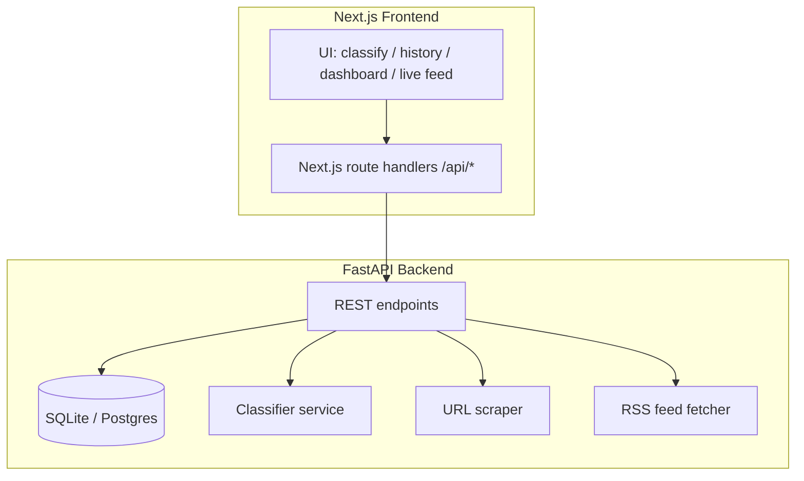

# CrisisClassifier

A full-stack crisis and emergency content classification system. Classifies news articles and text content into crisis categories using NLP, with a real-time dashboard for monitoring and analytics.

## Tech Stack

- **Frontend** — Next.js 15, TypeScript, Tailwind CSS, shadcn/ui, Recharts
- **Backend** — FastAPI, SQLAlchemy, SQLite (Postgres-ready)
- **ML** — Zero-shot classification (Hugging Face Transformers), optional fine-tuned model support

## Features

- Single text and URL-based classification (scrapes article content automatically)
- Batch CSV classification
- Classification history with filtering and export
- Analytics dashboard with category distribution, confidence metrics, and weekly trends
- Live RSS feed triage from configurable news sources
- Model comparison mode (keywords baseline vs. zero-shot vs. fine-tuned)
- REST API with Swagger documentation

## Architecture



## Getting Started

### Prerequisites

- Node.js 18+
- Python 3.10+

### Frontend

```bash
npm ci
npm run dev
```

### Backend

```bash
python -m venv .venv
# Linux/macOS
source .venv/bin/activate
# Windows PowerShell
.\.venv\Scripts\Activate.ps1

pip install -r backend/requirements.txt
uvicorn app.main:app --host 0.0.0.0 --port 8000 --reload
```

### Docker

```bash
docker compose up --build
```

## Configuration

Create a `backend/.env` file with the following variables:

| Variable | Default | Description |
|----------|---------|-------------|
| `APP_NAME` | `CrisisClassifier API` | Application name |
| `ENV` | `development` | Environment (development/production) |
| `ALLOWED_ORIGINS` | `http://localhost:3000` | CORS allowed origins |
| `DATABASE_URL` | `sqlite:///./data/app.db` | Database connection string |
| `CLASSIFIER_BACKEND` | `zero_shot` | Model backend (`keywords`, `zero_shot`) |
| `ZERO_SHOT_MODEL_ID` | `typeform/distilbert-base-uncased-mnli` | Hugging Face model for zero-shot |
| `MAX_TEXT_CHARS` | `20000` | Max input text length |
| `RSS_FEEDS` | *(NYT, BBC World)* | Comma-separated RSS feed URLs |

Create a root `.env` for the frontend:

| Variable | Default | Description |
|----------|---------|-------------|
| `BACKEND_URL` | `http://localhost:8000` | Backend API base URL |

## API

With the backend running, interactive docs are available at `http://localhost:8000/docs`.

| Method | Endpoint | Description |
|--------|----------|-------------|
| `GET` | `/api/health` | Health check |
| `POST` | `/api/classify` | Classify text or URL |
| `GET` | `/api/history` | Retrieve classification history |
| `GET` | `/api/stats` | Dashboard statistics |
| `GET` | `/api/live-feed` | Live RSS feed classifications |

## ML Training Pipeline

The `ml/` directory contains scripts for fine-tuning a custom classifier on CrisisBench data.

```bash
pip install -r ml/requirements-ml.txt
python ml/train.py --model_id distilbert-base-uncased --output_dir ml/artifacts/distilbert-crisisbench
python ml/evaluate.py --model_dir ml/artifacts/distilbert-crisisbench
python ml/export_model.py --model_dir ml/artifacts/distilbert-crisisbench --out_dir backend/model
```
