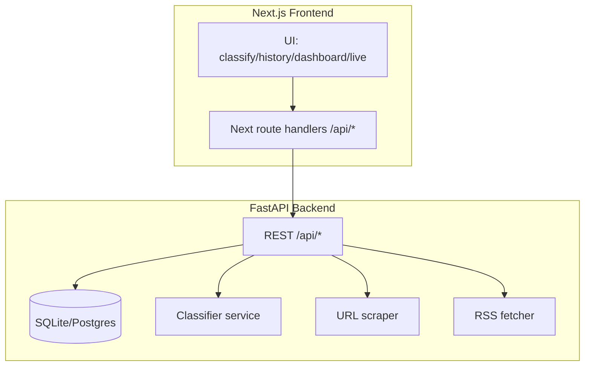

# CrisisClassifier

Portfolio-grade **full-stack** crisis / emergency content classifier:

- **Frontend**: Next.js 15 + TypeScript + Tailwind (shadcn/ui)
- **Backend**: FastAPI + SQLAlchemy (SQLite by default)
- **Model**: pluggable classifier service (default: **zero-shot** using a Hugging Face NLI checkpoint)
- **Features**: single classify, URL classify (scrape + classify), history + dashboard analytics, live RSS feed triage, batch CSV mode

## Architecture (high level)



## Quickstart (dev)

### 1) Frontend

```bash
npm ci
npm run dev
```

### 2) Backend

```bash
python -m venv .venv
. .venv/bin/activate  # Windows PowerShell: .\\.venv\\Scripts\\Activate.ps1
pip install -r backend/requirements.txt

# Copy env template
cp backend/.env.example backend/.env  # Windows: copy backend\\.env.example backend\\.env

uvicorn app.main:app --host 0.0.0.0 --port 8000 --reload
```

The frontend proxies to the backend using `BACKEND_URL` (server-side) via `app/api/*`.

### 3) Docker (optional)

```bash
cp backend/.env.example backend/.env
docker compose up --build
```

## API

With backend running, open:

- `http://localhost:8000/docs` (Swagger UI)
- `GET /api/health`
- `POST /api/classify`
- `GET /api/history`
- `GET /api/stats`
- `GET /api/live-feed`

## Model options

Set in `backend/.env`:

- `CLASSIFIER_BACKEND=zero_shot` (default)
  - Uses `ZERO_SHOT_MODEL_ID` (default: `typeform/distilbert-base-uncased-mnli`)
- `CLASSIFIER_BACKEND=keywords`
  - Fast deterministic baseline

## ML training pipeline (optional, for stronger performance)

The `ml/` folder provides scripts to fine-tune a classifier on CrisisBench.

```bash
pip install -r ml/requirements-ml.txt
python ml/train.py --model_id distilbert-base-uncased --output_dir ml/artifacts/distilbert-crisisbench
python ml/evaluate.py --model_dir ml/artifacts/distilbert-crisisbench
python ml/export_model.py --model_dir ml/artifacts/distilbert-crisisbench --out_dir backend/model
```

## Portfolio talking points

- **End-to-end product**: UI, API, persistence, analytics dashboard
- **Model choice & trade-offs**: keywords baseline vs. zero-shot vs. fine-tuned
- **Reproducibility**: pinned frontend dependencies + CI workflow
- **Production-minded**: `/api/health`, input limits, CORS config, docker-compose

